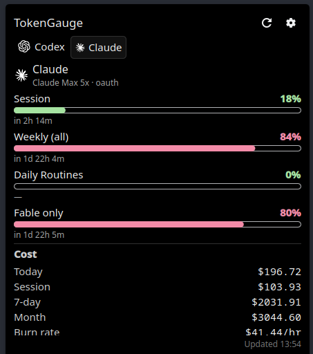

# TokenGauge

[](https://github.com/Arzaroth/TokenGauge/releases)

Monitor token usage, costs, and limits for AI coding assistants from your Waybar, KDE Plasma panel, and TUI. Powered by [CodexBar](https://github.com/steipete/CodexBar) for usage limits and [ccusage](https://github.com/ryoppippi/ccusage) for cost breakdown. Built for [Omarchy](https://omarchy.org) ([GitHub](https://github.com/basecamp/omarchy)) but works with any Waybar setup on Linux.

| Waybar | TUI | KDE Plasma |
|--------|-----|------------|
|  |  |  |

## Features

- **Waybar module**: bar + percentage per provider with brand-colored icons, pango-markup tooltip mirroring the TUI card layout
- **TUI dashboard** (ratatui): per-provider sidebar, Session / Weekly / Sonnet-only / Tertiary windows, Extra usage rates, cost breakdown
- **Native GTK4 popover**: bundled `tokengauge-popover` (gtk4-layer-shell) gives a click-to-open GUI panel with codexbar-style provider tabs, real provider brand logos (SVG, from [CodexBar](https://github.com/steipete/CodexBar); falls back to glyph icons when a logo is missing), color-tiered usage bars, monospace-aligned cost rows, and a collapsible 7-day chart. Pick `tui` or `popover` per `[waybar].click_action`.
- **KDE Plasma 6 applet**: native panel widget (QML plasmoid) mirroring the popover - brand-icon + percent in the panel, click-to-open popup with provider tabs, tier-tinted usage bars, cost rows, a 7-day chart, and an inline settings pane (toggle OAuth providers, pin the bar). Shares the same config, cache, and daemon as the Waybar module; the Waybar module keeps working untouched.
- **Cost tracking via ccusage**: today, month, 7-day rolling, per-model split, current burn rate $/hr, 7-day chart, trend vs 7d average
- **Multi-provider**: Claude, Codex, Copilot, Z.ai, Kimi, MiniMax (mix OAuth + API key providers)
- **Provider rotation**: scroll the waybar module to cycle through providers, or pin a primary
- **Threshold notifications**: `notify-send` alerts at 50/80/95% (configurable) - one-shot per threshold, resets on window roll-over
- **Daemon mode**: optional long-lived process for near-instant waybar polls, background notifications, and SIGHUP config reload
- **`--doctor`**: diagnostic checklist for codexbar, ccusage, notifications, providers, waybar wiring, click action launcher
- **CSS tier classes**: waybar text class flips to `tokengauge-warn` / `tokengauge-crit` past usage thresholds for theme-driven coloring

## Supported Providers

| Provider | Type | Config |
|----------|------|--------|
| Codex | OAuth | `codex = true` |
| Claude | OAuth | `claude = true` |
| Kimi K2 | API | `[providers.kimik2]` with `api_key` |
| z.ai | API | `[providers.zai]` with `api_key` |
| Copilot | API | `[providers.copilot]` with `api_key` |
| MiniMax | API | `[providers.minimax]` with `api_key` |
| Kimi | API | `[providers.kimi]` with `api_key` |

## Installation

```bash
curl -fsSL https://raw.githubusercontent.com/Arzaroth/TokenGauge/main/scripts/install.sh | bash
omarchy-restart-waybar
```

The installer detects `systemd --user`, drops in a `tokengauge-daemon.service`, and enables it. Pass `--no-daemon` to opt out and run in plain polling mode.

### Placement

By default the module is added to `modules-right` (before the tray on Omarchy). To put it on the left instead (right after `hyprland/workspaces`), run:

```bash
curl -fsSL https://raw.githubusercontent.com/Arzaroth/TokenGauge/main/scripts/install.sh | bash -s -- --placement=left
```

`TOKENGAUGE_PLACEMENT=left` also works. The choice is persisted in `~/.config/tokengauge/config.toml` under `[waybar] placement`; re-running the installer with a different `--placement` migrates the module to the other side.

## Mouse + keyboard

### Waybar mouse buttons

| Action | Binding |
|--------|---------|
| Run click action (TUI by default; configurable, see below) | left click |
| Refresh now (forced) | right click |
| Open provider dashboard | middle click |
| Open provider status page | back button (mouse 8) |
| Rotate selected provider | scroll up / down |

Left-click goes through `tokengauge-waybar --click`, which reads
`[waybar].click_action` (`"tui"` or `"popover"`) and spawns the matching
command. Pick the popover path to render a native GTK4 window
(`tokengauge-popover`) instead of opening the terminal TUI.

### TUI keys

| Key | Action |
|-----|--------|
| `r` | Refresh now |
| `h` / `l` / arrows / Tab / Shift-Tab | Previous / next provider tab |
| `j` / `k` / arrows | Scroll body |
| `g` / `G` / Home / End | Top / bottom |
| `u` | Open active provider's usage dashboard |
| `s` | Open active provider's status page |
| `q` / `Esc` | Quit |

## Configuration

Edit `~/.config/tokengauge/config.toml`:

| Field | Description | Default |
|-------|-------------|---------|
| `codexbar_bin` | Path to CodexBar CLI | `codexbar` |
| `refresh_secs` | Cache refresh interval (seconds) | `600` |
| `cache_file` | Cache file location | `/tmp/tokengauge-usage.json` |
| `timeout_secs` | Per-provider codexbar timeout | `10` |
| `stagger_ms` | Delay (ms) between provider fetch starts, to avoid 429 bursts (0 = all at once) | `0` |
| `ccusage_enabled` | Fetch cost data via `ccusage` | `true` |
| `ccusage_timeout_secs` | Per-call ccusage timeout (cold starts are slow) | `15` |
| `providers.codex` | Enable Codex (OAuth) | `true` |
| `providers.claude` | Enable Claude (OAuth) | `true` |
| `providers.<name>.api_key` | API key for API providers | — |
| `waybar.window` | Show `daily` or `weekly` usage in the bar | `daily` |
| `waybar.placement` | `left` or `right` in the waybar | `right` |
| `waybar.primary` | Provider key shown in the bar text (unset = stack all) | unset |
| `waybar.scroll_throttle_ms` | Debounce window for scroll-rotate | `250` |
| `waybar.click_action` | Left-click target: `tui` or `popover` | `tui` |
| `waybar.tui_command` | Override TUI launcher (empty = auto-detect) | unset |
| `waybar.popover_command` | Shell command run when `click_action = "popover"` | `tokengauge-popover --toggle` |
| `waybar.popover_margin_top` | Bundled popover's top-edge offset (px) | `4` |
| `waybar.popover_margin_side` | Bundled popover's side-edge offset (px) | `8` |
| `notifications.enabled` | Send desktop notifications | `true` |
| `notifications.thresholds` | Percent thresholds to fire on | `[50, 80, 95]` |

`ccusage` is auto-detected on PATH (preferring a global install, then `bunx`, then `npx`).

## CSS tier classes (waybar theming)

In addition to the base `tokengauge` class, the module sets one of these based on state:

| Class | When |
|-------|------|
| `tokengauge-refreshing` | A manual refresh is in flight |
| `tokengauge-error` | All providers failed to fetch |
| `tokengauge-partial-error` | At least one provider failed |
| `tokengauge-stale` | At least one provider is showing last-good cached data after a failed fetch (added on top of the tier class) |
| `tokengauge-crit` | Max session usage ≥ 80% |
| `tokengauge-warn` | Max session usage ≥ 50% (< 80%) |

Style them in `~/.config/waybar/style.css`:

```css
#custom-tokengauge.tokengauge-warn  { background: #f9e2af; color: black; }
#custom-tokengauge.tokengauge-crit  { background: #f38ba8; color: black; }
#custom-tokengauge.tokengauge-error { background: #45475a; color: #f38ba8; }
#custom-tokengauge.tokengauge-stale { opacity: 0.6; }
```

## Daemon mode (optional, faster)

Run TokenGauge as a long-lived daemon to skip ccusage cold starts on every waybar tick and to centralise periodic fetches:

```bash
mkdir -p ~/.config/systemd/user
cp scripts/tokengauge-daemon.service ~/.config/systemd/user/
systemctl --user daemon-reload
systemctl --user enable --now tokengauge-daemon
```

(The bundled installer does this automatically when `systemctl --user` is available.)

When the daemon is running:

- The 60-second waybar polls become near-instant: the bare `tokengauge-waybar` binary fetches the daemon's in-memory state via a Unix socket instead of spawning codexbar/ccusage on every tick.
- Right-click refresh, scroll rotate, and middle/back click for dashboard/status all route through the daemon so the next waybar snapshot reflects the new state immediately.
- Threshold notifications fire from the daemon even if you never interact with waybar.

Waybar config is unchanged - same `exec: tokengauge-waybar` with `interval: 60`. The binary auto-detects the socket and uses it; without the daemon it falls back to direct fetch.

The daemon also reloads its config on `SIGHUP` (`pkill -HUP tokengauge-waybar`) so theme / refresh_secs / providers / click action changes take effect without a restart.

## Click action: TUI vs popover

Left-click goes through `tokengauge-waybar --click`, which reads
`[waybar].click_action` and runs the matching command:

- `click_action = "tui"` (default): launches `tokengauge-tui` in a terminal.
  Auto-detects `omarchy-launch-or-focus-tui` when present, otherwise picks
  the first of `$TERMINAL`, `ghostty`, `alacritty`, `kitty`, `wezterm`,
  `foot`, `xterm` on `$PATH`. Override with `[waybar].tui_command`.

- `click_action = "popover"`: opens the bundled GTK4 popover
  (`tokengauge-popover --toggle`). The popover anchors under the waybar
  using `gtk4-layer-shell`, shows codexbar-style provider tabs with
  brand-coloured icons + tier-tinted session bars, monospace-aligned
  cost rows, and a collapsible 7-day chart. A second click on the waybar
  module toggles it closed. Tune `popover_margin_top` /
  `popover_margin_side` if it doesn't sit where you want. The **⚙ Settings**
  button flips the body to an inline pane: toggle the OAuth providers
  (Codex / Claude) and pick which provider is pinned to the bar (or
  `Highest`). Changes are written to `config.toml` live (comments
  preserved) and the daemon is signalled to reload - no restart needed.
  API-key providers are shown read-only there (enable them by adding an
  `api_key` to the config).

`tokengauge-waybar --doctor` reports the resolved click target and warns
when its leading binary isn't on `$PATH`. `popover_command` accepts any
shell command, so you can point it at another window toolkit if you'd
rather not use the bundled GTK4 popover.

## KDE Plasma widget

On KDE Plasma 6, TokenGauge ships a native panel applet (a QML plasmoid) that
mirrors the GTK popover - it is an additive fourth frontend, so your Waybar
module keeps working exactly as before. From a local checkout:

```bash
bash scripts/install-plasma.sh
```

The script builds the release binaries, installs the provider logos to
`~/.local/share/tokengauge/icons`, and registers the applet with
`kpackagetool6`. Then add it: right-click a panel or the desktop -> **Add
Widgets** -> search **TokenGauge**. If it doesn't show up yet, restart Plasma
(`kquitapp6 plasmashell && kstart plasmashell`).

The applet reads the same `~/.config/tokengauge/config.toml`, cache, and (when
running) daemon as the Waybar module. Under the hood it polls
`tokengauge-waybar --json` - a machine-readable snapshot of every provider's
usage, cost, and 7-day history - and drives all its actions (refresh, rotate,
open dashboard/status, provider toggles, pin) through the same
`tokengauge-waybar` binary, so the daemon stays the single source of truth and
threshold notifications keep firing.

Panel behaviour matches Waybar: left-click opens the popup, right-click
refreshes, middle-click opens the dashboard, back-button opens the status page,
scroll rotates the shown provider. Point the applet at a non-default binary or
change its poll interval in the widget's own settings.

> GNOME Shell is not supported yet. The `tokengauge-waybar --json` seam is
> desktop-agnostic, so a GNOME extension can be built on the same contract
> later.

## Diagnostics

Run `tokengauge-waybar --doctor` to print a grouped checklist:

```
Config        config loads
Dependencies  codexbar, ccusage runner, notify-send, xdg-open on PATH
Filesystem    cache directory writable
Providers     enabled list + per-provider live fetch result
Waybar        module wired in ~/.config/waybar/config.jsonc
```

Exit 0 if all pass, 1 if any fails - CI-friendly.

## Updates

```bash
# Update TokenGauge
curl -fsSL https://raw.githubusercontent.com/Arzaroth/TokenGauge/main/scripts/update.sh | bash

# Update CodexBar CLI
curl -fsSL https://raw.githubusercontent.com/Arzaroth/TokenGauge/main/scripts/update-codexbar.sh | bash
```

## Manual waybar wiring

The install script writes the snippet below automatically. To wire it manually,
add this to `~/.config/waybar/config.jsonc`:

```jsonc
"custom/tokengauge": {
  "exec": "tokengauge-waybar",
  "return-type": "json",
  "interval": 60,
  "signal": 8,
  "on-click": "tokengauge-waybar --click",
  "on-click-right": "tokengauge-waybar --refresh",
  "on-click-middle": "tokengauge-waybar --open=dashboard",
  "on-click-backward": "tokengauge-waybar --open=status",
  "on-scroll-up": "tokengauge-waybar --rotate=next",
  "on-scroll-down": "tokengauge-waybar --rotate=prev"
}
```

`tokengauge-waybar --click` resolves the launcher itself: it prefers
`omarchy-launch-or-focus-tui` when present, otherwise auto-picks a terminal
from `$TERMINAL` / ghostty / alacritty / kitty / wezterm / foot / xterm. To
override, set `[waybar].tui_command` in `config.toml`.

Other terminals: `alacritty -e tokengauge-tui`, `kitty -e tokengauge-tui`, `foot tokengauge-tui`.

## Manual Installation

1. Download the latest release from [GitHub Releases](https://github.com/Arzaroth/TokenGauge/releases)

2. Extract and install:
   ```bash
   tar -xzf tokengauge-<version>-linux-<arch>.tar.gz
   install -m 0755 tokengauge-waybar ~/.local/bin/
   install -m 0755 tokengauge-tui ~/.local/bin/
   ```

3. Create config:
   ```bash
   mkdir -p ~/.config/tokengauge
   cat > ~/.config/tokengauge/config.toml <<'EOF'
   codexbar_bin = "codexbar"
   refresh_secs = 600
   cache_file = "/tmp/tokengauge-usage.json"

   [providers]
   codex = true
   claude = true

   [waybar]
   window = "daily"
   placement = "right"

   [notifications]
   enabled = true
   thresholds = [50, 80, 95]
   EOF
   ```

4. Add the module to `~/.config/waybar/config.jsonc` (see the **Without Omarchy** section for the full JSON snippet). Place `"custom/tokengauge"` in either `modules-left` (after `"hyprland/workspaces"`) or `modules-right`.

5. Install [CodexBar CLI](https://github.com/steipete/CodexBar) if not already installed. Optionally install [ccusage](https://github.com/ryoppippi/ccusage) globally (`npm i -g ccusage` or `bun i -g ccusage`) for faster cost fetches.

6. (Optional) Set up the daemon - see **Daemon mode** above.

7. Restart Waybar.

## Windows 10 (TUI)

The Waybar module, the GTK4 popover, and the KDE Plasma applet are Linux-only
(they depend on Waybar / `gtk4-layer-shell` / Plasma). On Windows only the
**TUI dashboard** (`tokengauge-tui.exe`) is supported. It builds and runs
natively on Windows 10, tracking **cost and token usage via ccusage**. Usage
**limits** need a `codexbar` binary, which upstream [CodexBar](https://github.com/steipete/CodexBar)
does not ship for Windows - see the note below.

### Prerequisites

- **[Node.js](https://nodejs.org/)** (or [Bun](https://bun.sh/)) - so `ccusage`
  can run. TokenGauge auto-detects `ccusage`, then `bunx ccusage`, then
  `npx --yes ccusage` on your `PATH`. Installing it globally
  (`npm i -g ccusage`) is fastest but optional.
- *(Optional, for limits)* a Windows `codexbar` binary - see **Limits on
  Windows** below.

### Install

**Quick install (PowerShell):** downloads the latest release, installs
`tokengauge-tui.exe`, adds it to your user `PATH`, and writes a default config:

```powershell
irm https://raw.githubusercontent.com/Arzaroth/TokenGauge/master/scripts/install.ps1 | iex
```

Or run a local checkout with `powershell -ExecutionPolicy Bypass -File scripts\install.ps1`.

**Manual:**

1. Download `tokengauge-<version>-windows-x86_64.zip` from
   [GitHub Releases](https://github.com/Arzaroth/TokenGauge/releases) and unzip
   it. Put `tokengauge-tui.exe` somewhere on your `PATH` (or just run it from the
   unzipped folder).

2. Run it from **Windows Terminal**, **PowerShell**, or **cmd**:
   ```powershell
   tokengauge-tui.exe
   ```

On first run a default config is created at
`%APPDATA%\tokengauge\config.toml` and the usage cache is written to
`%TEMP%\tokengauge-usage.json`. A minimal config:

```toml
codexbar_bin = "codexbar"
refresh_secs = 600

[providers]
codex = true
claude = true
```

### Build from source (Windows)

With the [Rust toolchain](https://rustup.rs/) installed:

```powershell
cargo build --release -p tokengauge-tui
# binary at target\release\tokengauge-tui.exe
```

`cargo build` (no `--workspace`) only builds the cross-platform crates
(`tokengauge-core` + `tokengauge-tui`); the Linux-only crates are excluded via
`default-members`. Do **not** pass `--workspace` on Windows.

### Tray GUI (`tokengauge-tray`)

Prefer a window over the terminal? `tokengauge-tray` is a Windows system-tray
app (egui) that shows per-provider **Session / Weekly** usage bars and reset
times in a small window, backed by a tray icon. It shares the same config and
cache as the TUI and refreshes in the background.

```powershell
cargo build --release -p tokengauge-tray
.\target\release\tokengauge-tray.exe
```

- Left-click the tray icon (near the clock) to show the window; closing the
  window hides it back to the tray.
- Right-click the tray icon for **Show / Refresh now / Quit**.
- It reads limits from the same `codexbar_bin` as the TUI, so set that up first
  (see **Limits on Windows** below). This crate is Windows-only.

### Limits on Windows

Upstream CodexBar ships a `codexbar` CLI for macOS and Linux only. Without a
codexbar binary, every provider errors ("failed to spawn codexbar") and the TUI
has nothing to show, since rows are built from codexbar data. To get real data
on Windows, use **[Win-CodexBar](https://github.com/Finesssee/Win-CodexBar)**, a
faithful Windows port whose bundled `codexbar-cli.exe` speaks the same
`usage --provider … --source oauth --format json` interface and emits the same
JSON schema TokenGauge parses.

1. Install it: `winget install Finesssee.Win-CodexBar`, then sign in so it can
   read your Claude/Codex usage.
2. Point TokenGauge at its CLI in `%APPDATA%\tokengauge\config.toml`:
   ```toml
   # full path, or just "codexbar-cli" if its folder is on PATH
   codexbar_bin = "C:\\Program Files\\Win-CodexBar\\codexbar-cli.exe"
   ```
3. Restart `tokengauge-tui`.

TokenGauge omits the `--json-only` flag on Windows automatically (Win-CodexBar's
`usage` command doesn't define it, and `--format json` already yields clean
JSON), so `codexbar-cli.exe` works as a drop-in. `codexbar_bin` must resolve to
an `.exe` (a `.cmd`/`.bat` shim won't spawn); use its full path if it isn't on
`PATH`.
