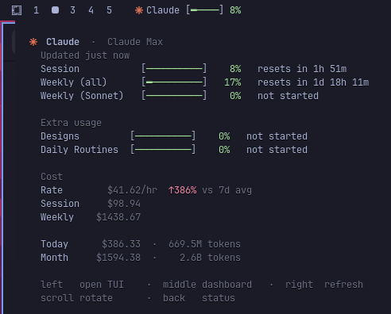
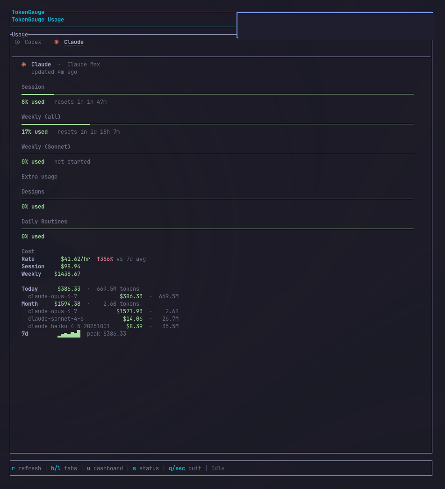

# TokenGauge

[](https://github.com/Arzaroth/TokenGauge/releases)

Monitor token usage, costs, and limits for AI coding assistants from your Waybar and TUI. Powered by [CodexBar](https://github.com/steipete/CodexBar) for usage limits and [ccusage](https://github.com/ryoppippi/ccusage) for cost breakdown. Built for [Omarchy](https://omarchy.org) ([GitHub](https://github.com/basecamp/omarchy)) but works with any Waybar setup on Linux.

| Waybar | TUI |
|--------|-----|
|  |  |

## Features

- **Waybar module**: bar + percentage per provider with brand-colored icons, pango-markup tooltip mirroring the TUI card layout
- **TUI dashboard** (ratatui): per-provider sidebar, Session / Weekly / Sonnet-only / Tertiary windows, Extra usage rates, cost breakdown
- **Native GTK4 popover**: bundled `tokengauge-popover` (gtk4-layer-shell) gives a click-to-open GUI panel with codexbar-style provider tabs, real provider brand logos (SVG, from [CodexBar](https://github.com/steipete/CodexBar); falls back to glyph icons when a logo is missing), color-tiered usage bars, monospace-aligned cost rows, and a collapsible 7-day chart. Pick `tui` or `popover` per `[waybar].click_action`.
- **Cost tracking via ccusage**: today, month, 7-day rolling, per-model split, current burn rate $/hr, 7-day chart, trend vs 7d average
- **Multi-provider**: Claude, Codex, Copilot, Z.ai, Kimi, MiniMax (mix OAuth + API key providers)
- **Provider rotation**: scroll the waybar module to cycle through providers, or pin a primary
- **Threshold notifications**: `notify-send` alerts at 50/80/95% (configurable) - one-shot per threshold, resets on window roll-over
- **Daemon mode**: optional long-lived process for near-instant waybar polls, background notifications, and SIGHUP config reload
- **`--doctor`**: diagnostic checklist for codexbar, ccusage, notifications, providers, waybar wiring, click action launcher
- **CSS tier classes**: waybar text class flips to `tokengauge-warn` / `tokengauge-crit` past usage thresholds for theme-driven coloring

## Supported Providers

| Provider | Type | Config |
|----------|------|--------|
| Codex | OAuth | `codex = true` |
| Claude | OAuth | `claude = true` |
| Kimi K2 | API | `[providers.kimik2]` with `api_key` |
| z.ai | API | `[providers.zai]` with `api_key` |
| Copilot | API | `[providers.copilot]` with `api_key` |
| MiniMax | API | `[providers.minimax]` with `api_key` |
| Kimi | API | `[providers.kimi]` with `api_key` |

## Installation

```bash
curl -fsSL https://raw.githubusercontent.com/Arzaroth/TokenGauge/main/scripts/install.sh | bash
omarchy-restart-waybar
```

The installer detects `systemd --user`, drops in a `tokengauge-daemon.service`, and enables it. Pass `--no-daemon` to opt out and run in plain polling mode.

### Placement

By default the module is added to `modules-right` (before the tray on Omarchy). To put it on the left instead (right after `hyprland/workspaces`), run:

```bash
curl -fsSL https://raw.githubusercontent.com/Arzaroth/TokenGauge/main/scripts/install.sh | bash -s -- --placement=left
```

`TOKENGAUGE_PLACEMENT=left` also works. The choice is persisted in `~/.config/tokengauge/config.toml` under `[waybar] placement`; re-running the installer with a different `--placement` migrates the module to the other side.

## Mouse + keyboard

### Waybar mouse buttons

| Action | Binding |
|--------|---------|
| Run click action (TUI by default; configurable, see below) | left click |
| Refresh now (forced) | right click |
| Open provider dashboard | middle click |
| Open provider status page | back button (mouse 8) |
| Rotate selected provider | scroll up / down |

Left-click goes through `tokengauge-waybar --click`, which reads
`[waybar].click_action` (`"tui"` or `"popover"`) and spawns the matching
command. Pick the popover path to render a native GTK4 window
(`tokengauge-popover`) instead of opening the terminal TUI.

### TUI keys

| Key | Action |
|-----|--------|
| `r` | Refresh now |
| `h` / `l` / arrows / Tab / Shift-Tab | Previous / next provider tab |
| `j` / `k` / arrows | Scroll body |
| `g` / `G` / Home / End | Top / bottom |
| `u` | Open active provider's usage dashboard |
| `s` | Open active provider's status page |
| `q` / `Esc` | Quit |

## Configuration

Edit `~/.config/tokengauge/config.toml`:

| Field | Description | Default |
|-------|-------------|---------|
| `codexbar_bin` | Path to CodexBar CLI | `codexbar` |
| `refresh_secs` | Cache refresh interval (seconds) | `600` |
| `cache_file` | Cache file location | `/tmp/tokengauge-usage.json` |
| `timeout_secs` | Per-provider codexbar timeout | `10` |
| `stagger_ms` | Delay (ms) between provider fetch starts, to avoid 429 bursts (0 = all at once) | `0` |
| `ccusage_enabled` | Fetch cost data via `ccusage` | `true` |
| `ccusage_timeout_secs` | Per-call ccusage timeout (cold starts are slow) | `15` |
| `providers.codex` | Enable Codex (OAuth) | `true` |
| `providers.claude` | Enable Claude (OAuth) | `true` |
| `providers.<name>.api_key` | API key for API providers | — |
| `waybar.window` | Show `daily` or `weekly` usage in the bar | `daily` |
| `waybar.placement` | `left` or `right` in the waybar | `right` |
| `waybar.primary` | Provider key shown in the bar text (unset = stack all) | unset |
| `waybar.scroll_throttle_ms` | Debounce window for scroll-rotate | `250` |
| `waybar.click_action` | Left-click target: `tui` or `popover` | `tui` |
| `waybar.tui_command` | Override TUI launcher (empty = auto-detect) | unset |
| `waybar.popover_command` | Shell command run when `click_action = "popover"` | `tokengauge-popover --toggle` |
| `waybar.popover_margin_top` | Bundled popover's top-edge offset (px) | `4` |
| `waybar.popover_margin_side` | Bundled popover's side-edge offset (px) | `8` |
| `notifications.enabled` | Send desktop notifications | `true` |
| `notifications.thresholds` | Percent thresholds to fire on | `[50, 80, 95]` |

`ccusage` is auto-detected on PATH (preferring a global install, then `bunx`, then `npx`).

## CSS tier classes (waybar theming)

In addition to the base `tokengauge` class, the module sets one of these based on state:

| Class | When |
|-------|------|
| `tokengauge-refreshing` | A manual refresh is in flight |
| `tokengauge-error` | All providers failed to fetch |
| `tokengauge-partial-error` | At least one provider failed |
| `tokengauge-stale` | At least one provider is showing last-good cached data after a failed fetch (added on top of the tier class) |
| `tokengauge-crit` | Max session usage ≥ 80% |
| `tokengauge-warn` | Max session usage ≥ 50% (< 80%) |

Style them in `~/.config/waybar/style.css`:

```css
#custom-tokengauge.tokengauge-warn  { background: #f9e2af; color: black; }
#custom-tokengauge.tokengauge-crit  { background: #f38ba8; color: black; }
#custom-tokengauge.tokengauge-error { background: #45475a; color: #f38ba8; }
#custom-tokengauge.tokengauge-stale { opacity: 0.6; }
```

## Daemon mode (optional, faster)

Run TokenGauge as a long-lived daemon to skip ccusage cold starts on every waybar tick and to centralise periodic fetches:

```bash
mkdir -p ~/.config/systemd/user
cp scripts/tokengauge-daemon.service ~/.config/systemd/user/
systemctl --user daemon-reload
systemctl --user enable --now tokengauge-daemon
```

(The bundled installer does this automatically when `systemctl --user` is available.)

When the daemon is running:

- The 60-second waybar polls become near-instant: the bare `tokengauge-waybar` binary fetches the daemon's in-memory state via a Unix socket instead of spawning codexbar/ccusage on every tick.
- Right-click refresh, scroll rotate, and middle/back click for dashboard/status all route through the daemon so the next waybar snapshot reflects the new state immediately.
- Threshold notifications fire from the daemon even if you never interact with waybar.

Waybar config is unchanged - same `exec: tokengauge-waybar` with `interval: 60`. The binary auto-detects the socket and uses it; without the daemon it falls back to direct fetch.

The daemon also reloads its config on `SIGHUP` (`pkill -HUP tokengauge-waybar`) so theme / refresh_secs / providers / click action changes take effect without a restart.

## Click action: TUI vs popover

Left-click goes through `tokengauge-waybar --click`, which reads
`[waybar].click_action` and runs the matching command:

- `click_action = "tui"` (default): launches `tokengauge-tui` in a terminal.
  Auto-detects `omarchy-launch-or-focus-tui` when present, otherwise picks
  the first of `$TERMINAL`, `ghostty`, `alacritty`, `kitty`, `wezterm`,
  `foot`, `xterm` on `$PATH`. Override with `[waybar].tui_command`.

- `click_action = "popover"`: opens the bundled GTK4 popover
  (`tokengauge-popover --toggle`). The popover anchors under the waybar
  using `gtk4-layer-shell`, shows codexbar-style provider tabs with
  brand-coloured icons + tier-tinted session bars, monospace-aligned
  cost rows, and a collapsible 7-day chart. A second click on the waybar
  module toggles it closed. Tune `popover_margin_top` /
  `popover_margin_side` if it doesn't sit where you want.

`tokengauge-waybar --doctor` reports the resolved click target and warns
when its leading binary isn't on `$PATH`. `popover_command` accepts any
shell command, so you can point it at another window toolkit if you'd
rather not use the bundled GTK4 popover.

## Diagnostics

Run `tokengauge-waybar --doctor` to print a grouped checklist:

```
Config        config loads
Dependencies  codexbar, ccusage runner, notify-send, xdg-open on PATH
Filesystem    cache directory writable
Providers     enabled list + per-provider live fetch result
Waybar        module wired in ~/.config/waybar/config.jsonc
```

Exit 0 if all pass, 1 if any fails - CI-friendly.

## Updates

```bash
# Update TokenGauge
curl -fsSL https://raw.githubusercontent.com/Arzaroth/TokenGauge/main/scripts/update.sh | bash

# Update CodexBar CLI
curl -fsSL https://raw.githubusercontent.com/Arzaroth/TokenGauge/main/scripts/update-codexbar.sh | bash
```

## Manual waybar wiring

The install script writes the snippet below automatically. To wire it manually,
add this to `~/.config/waybar/config.jsonc`:

```jsonc
"custom/tokengauge": {
  "exec": "tokengauge-waybar",
  "return-type": "json",
  "interval": 60,
  "signal": 8,
  "on-click": "tokengauge-waybar --click",
  "on-click-right": "tokengauge-waybar --refresh",
  "on-click-middle": "tokengauge-waybar --open=dashboard",
  "on-click-backward": "tokengauge-waybar --open=status",
  "on-scroll-up": "tokengauge-waybar --rotate=next",
  "on-scroll-down": "tokengauge-waybar --rotate=prev"
}
```

`tokengauge-waybar --click` resolves the launcher itself: it prefers
`omarchy-launch-or-focus-tui` when present, otherwise auto-picks a terminal
from `$TERMINAL` / ghostty / alacritty / kitty / wezterm / foot / xterm. To
override, set `[waybar].tui_command` in `config.toml`.

Other terminals: `alacritty -e tokengauge-tui`, `kitty -e tokengauge-tui`, `foot tokengauge-tui`.

## Manual Installation

1. Download the latest release from [GitHub Releases](https://github.com/Arzaroth/TokenGauge/releases)

2. Extract and install:
   ```bash
   tar -xzf tokengauge-<version>-linux-<arch>.tar.gz
   install -m 0755 tokengauge-waybar ~/.local/bin/
   install -m 0755 tokengauge-tui ~/.local/bin/
   ```

3. Create config:
   ```bash
   mkdir -p ~/.config/tokengauge
   cat > ~/.config/tokengauge/config.toml <<'EOF'
   codexbar_bin = "codexbar"
   refresh_secs = 600
   cache_file = "/tmp/tokengauge-usage.json"

   [providers]
   codex = true
   claude = true

   [waybar]
   window = "daily"
   placement = "right"

   [notifications]
   enabled = true
   thresholds = [50, 80, 95]
   EOF
   ```

4. Add the module to `~/.config/waybar/config.jsonc` (see the **Without Omarchy** section for the full JSON snippet). Place `"custom/tokengauge"` in either `modules-left` (after `"hyprland/workspaces"`) or `modules-right`.

5. Install [CodexBar CLI](https://github.com/steipete/CodexBar) if not already installed. Optionally install [ccusage](https://github.com/ryoppippi/ccusage) globally (`npm i -g ccusage` or `bun i -g ccusage`) for faster cost fetches.

6. (Optional) Set up the daemon - see **Daemon mode** above.

7. Restart Waybar.
