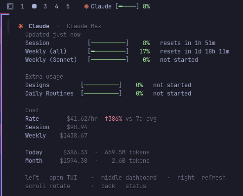
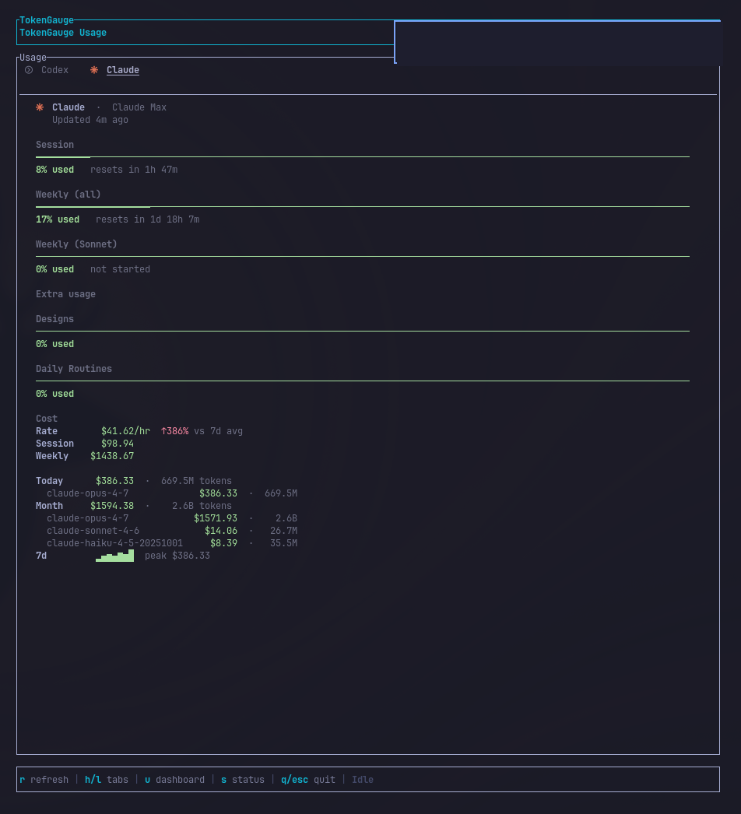
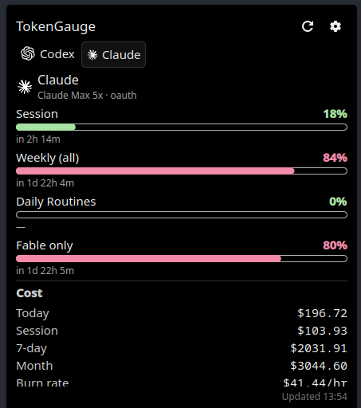

# TokenGauge

[](https://github.com/Arzaroth/TokenGauge/releases)

Monitor token usage, costs, and limits for AI coding assistants from your Waybar, KDE Plasma panel, GNOME Shell panel, and TUI. Usage limits are fetched natively over HTTP for Claude, Codex, Kimi, Grok, and GLM (z.ai), and costs are read natively too - straight from the transcripts the CLIs write, rated against [LiteLLM](https://github.com/BerriAI/litellm)'s price table. [ccusage](https://github.com/ryoppippi/ccusage) is optional, kept as a fallback and a cross-check. Built for [Omarchy](https://omarchy.org) ([GitHub](https://github.com/basecamp/omarchy)) but works with any Waybar setup on Linux.

| Waybar | TUI | KDE Plasma |
|--------|-----|------------|
|  |  |  |

## Features

- **Waybar module**: bar + percentage per provider with brand-colored icons, and a pango-markup tooltip that *is* the waybar panel - every section below, drawn with text bars
- **TUI dashboard** (ratatui): per-provider sidebar, Session / Weekly / Sonnet-only / Tertiary windows, Extra usage rates, cost breakdown
- **Fleet sync**: add up tokens and cost across every machine you code on. One encrypted object per machine, moved through a folder your sync tool already handles or an S3-compatible bucket. No service to run, no account to make. See [Fleet sync](#fleet-sync).
- **One panel, five surfaces**: the waybar tooltip, the KDE Plasma applet, the GNOME extension, the Quickshell widget and the Windows tray window all render the same sections in the same order - LIMITS, COST, TOKENS BY DAY, TOKENS BY MODEL, TOKENS BY DEVICE - from a single layout resolved in `tokengauge-core`. See [CLAUDE.md](CLAUDE.md) for the parity rule.
- **KDE Plasma 6 applet**: native panel widget (QML plasmoid) - brand-icon + percent in the panel, click-to-open popup with provider tabs, tier-tinted usage bars, cost rows, per-day and per-model token bars, and an inline settings pane (toggle OAuth providers, pin the bar). Shares the same config, cache, and daemon as the Waybar module; the Waybar module keeps working untouched.
- **Native cost tracking**: today, month, 7-day rolling, per-model split, burn rate $/hr anchored to the provider's real session window, 7-day chart, today's spend vs the average of the prior days
- **Multi-provider**: Claude, Codex, Kimi, Grok, and GLM (z.ai)
- **GNOME Shell extension**: panel indicator for GNOME 45+ mirroring the Plasma applet - brand icon + percent in the panel, click-to-open popup with provider tabs, tier-tinted usage bars, cost rows, per-day and per-model token bars, and pin-to-bar, plus an Adwaita preferences window for the provider toggles. Shares the same config, cache, and daemon as the Waybar module.
- **Pace tracking**: every usage window - including Claude's model-scoped weeklies like `Fable only` - projects where it lands at reset from the current burn rate (`ends ~16%`, or `empty in 2h 15m` when it runs out first), shown next to each reset on every frontend (hidden until 3% of the window has elapsed)
- **Provider rotation**: scroll the waybar module to cycle through providers, or pin a primary
- **Threshold notifications**: `notify-send` alerts at 50/80/95% (configurable) - one-shot per threshold, resets on window roll-over
- **Daemon mode**: optional long-lived process for near-instant waybar polls, background notifications, and SIGHUP config reload
- **Self-update**: `tokengauge --update` pulls the arch-matching build from GitHub releases; the daemon checks periodically and notifies, and the desktop frontends expose an **Update** button
- **`--doctor`**: diagnostic checklist for credentials, cost source (including a native-vs-ccusage cross-check), notifications, providers, waybar wiring, click action launcher
- **CSS tier classes**: waybar text class flips to `tokengauge-warn` / `tokengauge-crit` past usage thresholds for theme-driven coloring

## Supported Providers

| Provider | Type | Config | Credentials |
|----------|------|--------|-------------|
| Codex | OAuth | `codex = true` | `$CODEX_HOME/auth.json` (`codex` CLI) |
| Claude | OAuth | `claude = true` | `~/.claude/.credentials.json` (`claude` CLI) |
| Kimi | CLI / API key | `kimi = true` | `~/.kimi-code/credentials/kimi-code.json` or `KIMI_CODE_API_KEY` |
| Grok | CLI | `grok = true` | `~/.grok/auth.json` (`grok login`) |
| GLM | API key | `glm = true` | `Z_AI_API_KEY` env (legacy `ZAI_API_TOKEN`) |

All providers are read-only: TokenGauge never refreshes a token. Codex refreshes its own. For CLI-backed credentials, re-run the respective CLI (`claude`, `kimi`, `grok login`) when a token expires. For env-key providers, update the variable instead: `KIMI_CODE_API_KEY` for Kimi (when set, it takes precedence over the CLI token) and `Z_AI_API_KEY` (legacy `ZAI_API_TOKEN`) for GLM, which has no sign-in CLI.

- **Kimi** (kimi.com/code): reuses the `kimi` CLI token, or set `KIMI_CODE_API_KEY`. `KIMI_CODE_HOME` overrides the CLI home.
- **Grok** (x.ai build): reads the `grok login` token. `GROK_HOME` overrides the auth directory.
- **GLM** (z.ai / zcode.z.ai): the GLM Coding Plan has no local credential file, so set `Z_AI_API_KEY` (the same key you use for `ANTHROPIC_AUTH_TOKEN`). Set `Z_AI_API_HOST=open.bigmodel.cn` for the China BigModel region, or `Z_AI_QUOTA_URL` to override the full quota endpoint.

## Installation

```bash
curl -fsSL https://raw.githubusercontent.com/Arzaroth/TokenGauge/master/scripts/install.sh | bash
omarchy-restart-waybar
```

The installer detects `systemd --user`, drops in a `tokengauge-daemon.service`, and enables it. Pass `--no-daemon` to opt out and run in plain polling mode.

### Placement

By default the module is added to `modules-right` (before the tray on Omarchy). To put it on the left instead (right after `hyprland/workspaces`), run:

```bash
curl -fsSL https://raw.githubusercontent.com/Arzaroth/TokenGauge/master/scripts/install.sh | bash -s -- --placement=left
```

`TOKENGAUGE_PLACEMENT=left` also works. The choice is persisted in `~/.config/tokengauge/config.toml` under `[waybar] placement`; re-running the installer with a different `--placement` migrates the module to the other side.

## Mouse + keyboard

### Waybar mouse buttons

| Action | Binding |
|--------|---------|
| Run click action (TUI by default; configurable, see below) | left click |
| Refresh now (forced) | right click |
| Open provider dashboard | middle click |
| Open provider status page | back button (mouse 8) |
| Rotate selected provider | scroll up / down |

Left-click goes through `tokengauge --click`, which launches the
terminal TUI. The waybar panel itself is the tooltip - hover the module.

### TUI keys

| Key | Action |
|-----|--------|
| `r` | Refresh now |
| `h` / `l` / arrows / Tab / Shift-Tab | Previous / next provider tab |
| `j` / `k` / arrows | Scroll body |
| `g` / `G` / Home / End | Top / bottom |
| `u` | Open active provider's usage dashboard |
| `s` | Open active provider's status page |
| `S` | Fleet sync setup |
| `q` / `Esc` | Quit |

## Configuration

Edit `~/.config/tokengauge/config.toml`:

| Field | Description | Default |
|-------|-------------|---------|
| `refresh_secs` | Cache refresh interval (seconds) | `600` |
| `cache_file` | Snapshot location. The daemon socket, the selected provider and the refresh sentinel live beside it | `$XDG_STATE_HOME/tokengauge/tokengauge-usage.json` (`%LOCALAPPDATA%\TokenGauge\…` on Windows) |
| `timeout_secs` | Per-provider fetch timeout | `20` |
| `stagger_ms` | Delay (ms) between provider fetch starts, to avoid 429 bursts (0 = all at once) | `0` |
| `ccusage_enabled` | Master switch for cost figures | `true` |
| `cost_source` | `auto` (native, ccusage fallback), `native`, or `ccusage` | `auto` |
| `ccusage_timeout_secs` | Per-call ccusage timeout, and price-refresh timeout | `15` |
| `providers.codex` | Enable Codex (OAuth) | `true` |
| `providers.claude` | Enable Claude (OAuth) | `true` |
| `waybar.window` | Show `daily` or `weekly` usage in the bar | `daily` |
| `waybar.placement` | `left` or `right` in the waybar | `right` |
| `waybar.primary` | Provider key shown in the bar text (unset = stack all) | unset |
| `waybar.scroll_throttle_ms` | Debounce window for scroll-rotate | `250` |
| `waybar.click_action` | Left-click target. Only `tui` remains; `popover` still parses and resolves to the TUI | `tui` |
| `waybar.tui_command` | Override TUI launcher (empty = auto-detect) | unset |
| `notifications.enabled` | Send desktop notifications | `true` |
| `notifications.thresholds` | Percent thresholds to fire on | `[50, 80, 95]` |
| `update.check` | Daemon checks GitHub releases and notifies when a newer version exists | `true` |
| `update.check_interval_secs` | Seconds between daemon update checks | `21600` |

`ccusage` is auto-detected on PATH (preferring a global install, then `bunx`, then `npx`).

## Fleet sync

Two machines, one set of figures. Turn it on and the cost, token and burn rows
cover the whole fleet, with a **TOKENS BY DEVICE** section showing where the
spend came from.

There is no service and no account. Each machine writes **one encrypted object
that only it ever writes**, into storage you already have, and reads the others.
Single-writer objects are why there is no conflict resolution anywhere in this:
no two machines ever write the same thing.

### Setting it up

On the first machine:

```bash
tokengauge --sync-setup        # opens the TUI's sync screen in a terminal
```

Press `e` to turn sync on, `d` to point it at a folder your sync tool handles
(`~/Sync/tokengauge`, a Dropbox or Nextcloud folder, a NAS mount), `g` to
generate the fleet key, and `t` to check the round trip. Copy the key it shows.

On every other machine, the same screen, but press `j` and paste the key instead
of `g`. Or from a shell, reading the key from stdin:

```bash
tokengauge --sync-join -
```

Pass the key as an argument only in a script you trust: an argument lands in
shell history and in `/proc/<pid>/cmdline`, and possession of the key is the
only authentication there is.

The desktop frontends all have a button for this: the Plasma applet's settings
pane, the GNOME popup header, `y` in the Omarchy widget's settings, and the
Windows tray menu.

### An S3-compatible bucket instead

Press `x` on the sync screen to switch, then set the endpoint, bucket, region
and prefix. Works with S3, Cloudflare R2, Backblaze B2's S3 endpoint, MinIO and
Garage. Credentials come from `AWS_ACCESS_KEY_ID` and `AWS_SECRET_ACCESS_KEY`
rather than the config file.

```toml
[sync]
enabled = true
transport = "s3"
label = "desktop"

[sync.s3]
endpoint = "https://<account>.r2.cloudflarestorage.com"
region = "auto"
bucket = "tokengauge"
prefix = "fleet/"
```

### What actually crosses the wire

Token counts, bucketed by UTC hour, provider and model. **Never dollars** -
money is tokens times each machine's own price table, so shipping a figure would
let a stale price table on one machine skew the fleet total. Never prompts, file
paths, project names or credentials.

Each object is sealed with XChaCha20-Poly1305 under the fleet key and named with
a keyed digest, so whoever holds the folder or bucket cannot read your usage or
tell which object belongs to which machine. Two things it does **not** hide:
there is one object per device, so they can count your machines, and write
timing is visible, so your working hours are too. And a symmetric key means there is
no revocation: a lost machine can read the fleet until you re-key every other
one with `--sync-init --sync-force` and `--sync-join`.

Re-keying starts a fleet, it does not rotate one in place. A machine that adopts
a new key drops the old fleet's devices from its panel, deletes the object it
published under the old key, and keeps its own history. The other machines
republish theirs on their next cycle, so what is actually lost is peer history
older than `retention_days`.

### If you sync `~/.claude/projects` yourself

Then both machines read the same transcripts and the fleet total doubles.
TokenGauge fingerprints each day and tells you when it sees this, counting the
day once, but the fix is to leave that provider out:

```toml
[sync.providers]
claude = false
codex = true
```

Providers whose costs come from ccusage - a Kimi or Grok plan driven from its own
CLI - cannot sync at all yet: there are no per-call events behind them to bucket.

### Checking on it

```bash
tokengauge --sync-status          # what the last cycle did; --json for the raw object
tokengauge --sync-test            # write a probe, read it back, remove it
tokengauge --sync-forget laptop   # drop a machine you no longer use
```

The COST section also carries a **Sync** row that leads with problems: a
transport that is down, an object it could not use, a fleet gone stale.
Configured-but-not-working under-reports silently, and a total that is quietly
too low is worse than one that is visibly missing.

## CSS tier classes (waybar theming)

In addition to the base `tokengauge` class, the module sets one of these based on state:

| Class | When |
|-------|------|
| `tokengauge-refreshing` | A manual refresh is in flight |
| `tokengauge-error` | All providers failed to fetch |
| `tokengauge-partial-error` | At least one provider failed |
| `tokengauge-stale` | At least one provider is showing last-good cached data after a failed fetch (added on top of the tier class) |
| `tokengauge-crit` | Max session usage ≥ 80% |
| `tokengauge-warn` | Max session usage ≥ 50% (< 80%) |

Style them in `~/.config/waybar/style.css`:

```css
#custom-tokengauge.tokengauge-warn  { background: #f9e2af; color: black; }
#custom-tokengauge.tokengauge-crit  { background: #f38ba8; color: black; }
#custom-tokengauge.tokengauge-error { background: #45475a; color: #f38ba8; }
#custom-tokengauge.tokengauge-stale { opacity: 0.6; }
```

## Daemon mode (optional, faster)

Run TokenGauge as a long-lived daemon to skip ccusage cold starts on every waybar tick and to centralise periodic fetches:

```bash
mkdir -p ~/.config/systemd/user
cp scripts/tokengauge-daemon.service ~/.config/systemd/user/
systemctl --user daemon-reload
systemctl --user enable --now tokengauge-daemon
```

(The bundled installer does this automatically when `systemctl --user` is available.)

When the daemon is running:

- The 60-second waybar polls become near-instant: the bare `tokengauge` binary fetches the daemon's in-memory state via a Unix socket instead of fetching usage and spawning ccusage on every tick.
- Right-click refresh, scroll rotate, and middle/back click for dashboard/status all route through the daemon so the next waybar snapshot reflects the new state immediately.
- Threshold notifications fire from the daemon even if you never interact with waybar.

Waybar config is unchanged - same `exec: tokengauge` with `interval: 60`. The binary auto-detects the socket and uses it; without the daemon it falls back to direct fetch.

The daemon also reloads its config on `SIGHUP` (`pkill -HUP -f 'tokengauge(-waybar)? --daemon'` - the old binary name still
starts daemons from an existing unit) so theme / refresh_secs / providers / click action changes take effect without a restart.

## Click action

Left-click goes through `tokengauge --click`, which launches
`tokengauge-tui` in a terminal. It auto-detects
`omarchy-launch-or-focus-tui` when present, otherwise picks the first of
`$TERMINAL`, `ghostty`, `alacritty`, `kitty`, `wezterm`, `foot`, `xterm`
on `$PATH`. Override with `[waybar].tui_command`.

`tokengauge --doctor` reports the resolved click target and warns
when its leading binary isn't on `$PATH`.

The bundled GTK4 popover was removed in 0.20.0: the waybar tooltip now
carries the full panel, so a second window showed nothing new. A config
still set to `click_action = "popover"` keeps loading and opens the TUI.

## KDE Plasma widget

On KDE Plasma 6, TokenGauge ships a native panel applet (a QML plasmoid) that
draws the same panel as every other frontend - it is additive, so your Waybar
module keeps working exactly as before. From a local checkout:

```bash
bash scripts/install-plasma.sh
```

The script builds the release binaries, installs the provider logos to
`~/.local/share/tokengauge/icons`, and registers the applet with
`kpackagetool6`. Then add it: right-click a panel or the desktop -> **Add
Widgets** -> search **TokenGauge**. If it doesn't show up yet, restart Plasma
(`kquitapp6 plasmashell && kstart plasmashell`).

The applet reads the same `~/.config/tokengauge/config.toml`, cache, and (when
running) daemon as the Waybar module. Under the hood it polls
`tokengauge --json` - a machine-readable snapshot of every provider's
usage, cost, and 7-day history - and drives all its actions (refresh, rotate,
open dashboard/status, provider toggles, pin) through the same
`tokengauge` binary, so the daemon stays the single source of truth and
threshold notifications keep firing.

Mouse behaviour matches the Waybar module: left-click opens the popup,
right-click refreshes, middle-click opens the dashboard, back-button opens the
status page, scroll rotates the shown provider. Point the applet at a non-default binary or change
its poll interval in the widget's own settings.

## GNOME Shell extension

On GNOME 45+, TokenGauge ships a Shell extension that puts the same panel
indicator and popup on GNOME - additive like the Plasma applet, so the Waybar
module keeps working. From a local checkout:

```bash
bash scripts/install-gnome.sh
```

The script builds the release binaries, installs the provider logos to
`~/.local/share/tokengauge/icons`, copies the extension into
`~/.local/share/gnome-shell/extensions/tokengauge@arzaroth.github.io`, compiles
its GSettings schema, and enables it. Reload the shell afterwards - Alt+F2 then
`r` on Xorg, or log out and back in on Wayland.

The panel button shows the pinned provider's brand icon and usage percent;
scroll it to cycle providers, middle-click to force a refresh, left-click for
the popup (provider tabs, tier-coloured usage bars with reset + pace, cost
rows, a 7-day chart, pin-to-bar, and the **Update** button when a release is
available). Binary path, refresh interval, panel percent, and the OAuth
provider toggles live in the extension's preferences
(`gnome-extensions prefs tokengauge@arzaroth.github.io`).

Like the Plasma applet it polls `tokengauge --json` and routes every
action back through the same binary, so the shared config, cache, daemon, and
threshold notifications are untouched.

## Diagnostics

Run `tokengauge --doctor` to print a grouped checklist:

```
Config        config loads
Credentials   Claude / Codex sign-in present
Dependencies  notify-send, xdg-open on PATH (ccusage optional)
Filesystem    cache directory writable
Providers     enabled list + per-provider live fetch result
Waybar        module wired in ~/.config/waybar/config.jsonc
```

Exit 0 if all pass, 1 if any fails - CI-friendly.

## Updates

The binaries self-update from GitHub releases, pulling the archive matching your
platform (`linux-x86_64` / `linux-aarch64` / `windows-x86_64`):

```bash
# Linux
tokengauge --update        # download the latest release and swap the binaries
tokengauge --check-update  # just report the latest version (prints JSON)
```

```powershell
# Windows (no waybar binary - the TUI carries the updater)
tokengauge-tui.exe --update
tokengauge-tui.exe --check-update
```

When the daemon is running it checks GitHub every `update.check_interval_secs`
(default 6h) and fires a one-shot `notify-send` when a newer version is
available - set `update.check = false` to opt out. The desktop frontends
surface an **Update** button when a newer release is cached; clicking it
runs `--update`. After a Linux update the daemon is restarted automatically to
load the new binary (falls back to printing the `systemctl --user restart
tokengauge-daemon.service` command when not managed by systemd). On Windows the
tray's **Update TokenGauge** menu item runs the updater; restart the app to load
the new binaries.

Set `TOKENGAUGE_REPO=owner/repo` to update from a fork's releases.

The shell installers still work if you prefer them:

```bash
# Update TokenGauge
curl -fsSL https://raw.githubusercontent.com/Arzaroth/TokenGauge/master/scripts/update.sh | bash
```

## Manual waybar wiring

The install script writes the snippet below automatically. To wire it manually,
add this to `~/.config/waybar/config.jsonc`:

```jsonc
"custom/tokengauge": {
  "exec": "tokengauge",
  "return-type": "json",
  "interval": 60,
  "signal": 8,
  "on-click": "tokengauge --click",
  "on-click-right": "tokengauge --refresh",
  "on-click-middle": "tokengauge --open=dashboard",
  "on-click-backward": "tokengauge --open=status",
  "on-scroll-up": "tokengauge --rotate=next",
  "on-scroll-down": "tokengauge --rotate=prev"
}
```

`tokengauge --click` resolves the launcher itself: it prefers
`omarchy-launch-or-focus-tui` when present, otherwise auto-picks a terminal
from `$TERMINAL` / ghostty / alacritty / kitty / wezterm / foot / xterm. To
override, set `[waybar].tui_command` in `config.toml`.

Other terminals: `alacritty -e tokengauge-tui`, `kitty -e tokengauge-tui`, `foot tokengauge-tui`.

## Manual Installation

1. Download the latest release from [GitHub Releases](https://github.com/Arzaroth/TokenGauge/releases)

2. Extract and install:
   ```bash
   tar -xzf tokengauge-<version>-linux-<arch>.tar.gz
   install -m 0755 tokengauge ~/.local/bin/
   install -m 0755 tokengauge-tui ~/.local/bin/
   # The binary was `tokengauge-waybar` before 0.23.0. Keep that name resolving
   # so an existing waybar config, systemd unit or frontend setting still works.
   ln -sf tokengauge ~/.local/bin/tokengauge-waybar
   ```

3. Create config:
   ```bash
   mkdir -p ~/.config/tokengauge
   cat > ~/.config/tokengauge/config.toml <<'EOF'
   refresh_secs = 600

   [providers]
   codex = true
   claude = true
   # kimi = true   # reads the `kimi` CLI token or KIMI_CODE_API_KEY
   # grok = true   # reads the `grok login` token
   # glm = true    # reads Z_AI_API_KEY (legacy ZAI_API_TOKEN)

   [waybar]
   window = "daily"
   placement = "right"

   [notifications]
   enabled = true
   thresholds = [50, 80, 95]

   [update]
   check = true
   EOF
   ```

4. Add the module to `~/.config/waybar/config.jsonc` (see the **Without Omarchy** section for the full JSON snippet). Place `"custom/tokengauge"` in either `modules-left` (after `"hyprland/workspaces"`) or `modules-right`.

5. Sign in to the providers you want and enable them under `[providers]`:
   - **Codex**: run `codex`; **Claude**: run `claude` (reads their OAuth credentials).
   - **Kimi**: run `kimi` to sign in, or set `KIMI_CODE_API_KEY`.
   - **Grok**: run `grok login`.
   - **GLM**: set `Z_AI_API_KEY` (legacy `ZAI_API_TOKEN`; add `Z_AI_API_HOST=open.bigmodel.cn` for the China BigModel region, or `Z_AI_QUOTA_URL` to override the full quota endpoint).

   Cost detail needs no extra tooling: TokenGauge reads the transcripts the CLIs already write. [ccusage](https://github.com/ryoppippi/ccusage) is optional, and only used as a fallback or a cross-check.

6. (Optional) Set up the daemon - see **Daemon mode** above.

7. Restart Waybar.

## Windows 10

The Waybar module, the KDE Plasma applet, the GNOME Shell extension and the
Quickshell/Omarchy widget are Linux-only (they depend on Waybar / Plasma /
GNOME Shell / Quickshell). On Windows two surfaces
are supported, both building and running natively on Windows 10: the
**TUI dashboard** (`tokengauge-tui.exe`) and a **system-tray GUI**
(`tokengauge-tray.exe`, see [Tray GUI](#tray-gui-tokengauge-tray) below).
Usage limits for every supported provider (Codex, Claude, Kimi, Grok, GLM) are
fetched natively over HTTP; sign in to the providers you enable so TokenGauge can
read their credentials. **Cost/token** detail is read natively too, from the
transcripts the CLIs write under `%USERPROFILE%\.claude` and `%USERPROFILE%\.codex`.
`ccusage` is optional: it covers a CLI TokenGauge does not parse yet, and
`--doctor` cross-checks against it. Neither source creates provider rows on its
own.

### Prerequisites

- **Sign in to the providers you enable** so TokenGauge can read their
  credentials and fetch usage natively: `codex` / `claude` (OAuth CLIs), `kimi`
  or `KIMI_CODE_API_KEY`, `grok login`, and `Z_AI_API_KEY` (legacy
  `ZAI_API_TOKEN`) for GLM.
- *(Optional)* **[Node.js](https://nodejs.org/)** (or [Bun](https://bun.sh/)).
  No longer needed for cost detail - TokenGauge reads the transcripts itself.
  Install `ccusage` only if you want the fallback for a CLI TokenGauge does not
  parse yet, or the `--doctor` cross-check. `npm i -g ccusage` is fastest.

### Install

**Quick install (PowerShell):** downloads the latest release, installs
`tokengauge-tui.exe`, adds it to your user `PATH`, and writes a default config:

```powershell
irm https://raw.githubusercontent.com/Arzaroth/TokenGauge/master/scripts/install.ps1 | iex
```

Or run a local checkout with `powershell -ExecutionPolicy Bypass -File scripts\install.ps1`.

**Manual:**

1. Download `tokengauge-<version>-windows-x86_64.zip` from
   [GitHub Releases](https://github.com/Arzaroth/TokenGauge/releases) and unzip
   it. Put `tokengauge-tui.exe` somewhere on your `PATH` (or just run it from the
   unzipped folder).

2. Run it from **Windows Terminal**, **PowerShell**, or **cmd**:
   ```powershell
   tokengauge-tui.exe
   ```

On first run a default config is created at
`%APPDATA%\tokengauge\config.toml` and the usage snapshot is written to
`%LOCALAPPDATA%\TokenGauge\tokengauge-usage.json`. A minimal config:

```toml
refresh_secs = 600

[providers]
codex = true
claude = true
```

### Build from source (Windows)

With the [Rust toolchain](https://rustup.rs/) installed:

```powershell
cargo build --release -p tokengauge-tui
# binary at target\release\tokengauge-tui.exe
```

`cargo build` (no `--workspace`) only builds the cross-platform crates
(`tokengauge-core` + `tokengauge-tui`); the Linux-only crates are excluded via
`default-members`. Do **not** pass `--workspace` on Windows.

### Tray GUI (`tokengauge-tray`)

Prefer a window over the terminal? `tokengauge-tray` is a Windows system-tray
app (egui) that shows per-provider **Session / Weekly** usage bars and reset
times in a small window, backed by a tray icon. It shares the same config and
cache as the TUI and refreshes in the background.

```powershell
cargo build --release -p tokengauge-tray
.\target\release\tokengauge-tray.exe
```

- Left-click the tray icon (near the clock) to show the window; closing the
  window hides it back to the tray.
- Right-click the tray icon for **Show / Refresh now / Update TokenGauge / Quit**
  (**Update** runs `tokengauge-tui --update`; restart the tray afterward).
- It reads the same OAuth credentials as the TUI, so sign in to the `codex`
  and/or `claude` CLIs first. This crate is Windows-only.

### Limits on Windows

Usage limits are fetched natively over HTTP on Windows, same as on Linux - no
extra binary is needed. Sign in to the `codex` and/or `claude` CLIs so
TokenGauge can read their OAuth credentials, then run `tokengauge-tui`.
